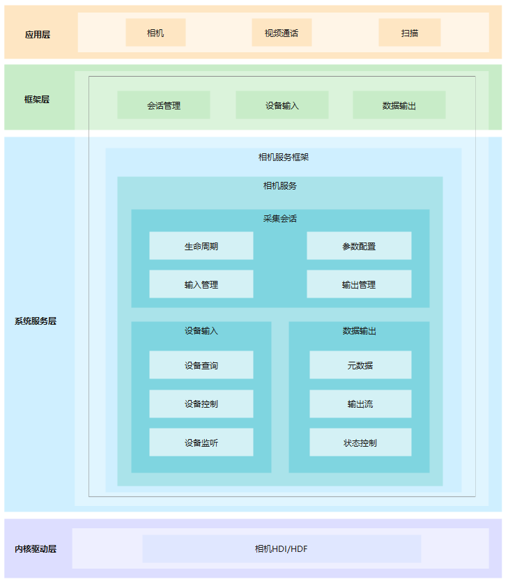

# Camera组件<a name="ZH-CN_TOPIC_0000001101564782"></a>

- [Camera组件<a name="ZH-CN_TOPIC_0000001101564782"></a>](#camera组件)
  - [简介<a name="section11660541593"></a>](#简介)
    - [基本概念<a name="sectionbasicconcepts"></a>](#基本概念)
  - [目录<a name="section176641621345"></a>](#目录)
  - [使用说明<a name="section45377346241"></a>](#使用说明)
    - [拍照<a name="section2071191842718"></a>](#拍照)
    - [开始和停止预览<a name="section2094314213271"></a>](#开始和停止预览)
    - [视频录像<a name="section1983913118271"></a>](#视频录像)
    - [切换多个照相机设备<a name="sectionswitchcamera"></a>](#切换多个照相机设备)
    - [设置闪光灯<a name="sectionsetflash"></a>](#设置闪光灯)
  - [相关仓<a name="section16511040154318"></a>](#相关仓)

## 简介<a name="section11660541593"></a>

相机组件支持相机业务的开发，开发者可以通过已开放的接口实现相机硬件的访问、操作和新功能开发，最常见的操作如：预览、拍照和录像等。

### 基本概念<a name="sectionbasicconcepts"></a>

-   拍照

    此功能用于拍摄采集照片。

-   预览

    此功能用于在开启相机后，在缓冲区内重复采集摄像帧，支持在拍照或录像前进行摄像帧预览显示。

-   录像

    此功能用于在开始录像后和结束录像前的时间段内，在缓冲区内重复采集摄像帧，支持视频录制。

**图 1**  相机组件架构图<a name="fig310889397"></a>



## 目录<a name="section176641621345"></a>

仓目录结构如下：

```
/foundation/multimedia/camera_standard   # 相机组件业务代码
├── frameworks                           # 框架代码
│   ├── native                           # 内部接口实现
│   │   ├── camera                       # 相机框架实现
│   │   └── metadata                     # 元数据实现
│   └── js                               # 外部接口实现
│       └── camera_napi                  # 相机NAPI实现
├── interfaces                           # 接口代码
│   ├── inner_api                        # 内部接口
│   └── kits                             # 外部接口
├── LICENSE                              # 许可证文件
├── ohos.build                           # 构建文件
├── sa_profile                           # 服务配置文件
└── services                             # 服务代码
    ├── camera_service                   # 相机服务实现
    └── etc                              # 相机服务配置
```

## 使用说明<a name="section45377346241"></a>

### 拍照<a name="section2071191842718"></a>

拍照的步骤:

1.  创建缓冲区消费者端监听器（CaptureSurfaceListener）以保存图像。
    ```
    class CaptureSurfaceListener : public IBufferConsumerListener {
    public:
        int32_t mode_;
        sptr<Surface> surface_;

        void OnBufferAvailable() override
        {
            int32_t flushFence = 0;
            int64_t timestamp = 0;
            OHOS::Rect damage; // initialize the damage

            OHOS::sptr<OHOS::SurfaceBuffer> buffer = nullptr;
            surface_->AcquireBuffer(buffer, flushFence, timestamp, damage);
            if (buffer != nullptr) {
                void *addr = buffer->GetVirAddr();
                int32_t size = buffer->GetSize();

                // Save the buffer(addr) to a file.

                surface_->ReleaseBuffer(buffer, -1);
            }
        }
    };
    ```

2.  获取相机管理器实例并获取相机对象列表。

    ```
    sptr<CameraManager> camManagerObj = CameraManager::GetInstance();
    std::vector<sptr<CameraInfo>> cameraObjList = camManagerObj->GetCameras();
    ```

3.  使用相机对象创建相机输入来打开相机。

    ```
    sptr<CaptureInput> cameraInput = camManagerObj->CreateCameraInput(cameraObjList[0]);
    ```

4.  创建采集会话。

    ```
    sptr<CaptureSession> captureSession = camManagerObj->CreateCaptureSession();
    ```

5.  开始配置采集会话。

    ```
    int32_t result = captureSession->BeginConfig();
    ```

6.  将相机输入添加到采集会话。

    ```
    result = captureSession->AddInput(cameraInput);
    ```

7.  创建消费者 Surface 并注册监听器以监听缓冲区更新。拍照的宽和高可以配置为所支持的 1280x960 分辨率。

    ```
    sptr<Surface> photoSurface = Surface::CreateSurfaceAsConsumer();
    int32_t photoWidth = 1280;
    int32_t photoHeight = 960;
    photoSurface->SetDefaultWidthAndHeight(photoWidth, photoHeight);
    photoSurface->SetUserData(CameraManager::surfaceFormat, std::to_string(OHOS_CAMERA_FORMAT_JPEG));
    sptr<CaptureSurfaceListener> capturelistener = new(std::nothrow) CaptureSurfaceListener();
    capturelistener->mode_ = MODE_PHOTO;
    capturelistener->surface_ = photoSurface;
    photoSurface->RegisterConsumerListener((sptr<IBufferConsumerListener> &)capturelistener);
    ```

8.  使用上面创建的 Surface 创建拍照输出。

    ```
    sptr<CaptureOutput> photoOutput = camManagerObj->CreatePhotoOutput(photoSurface);
    ```

9.  将拍照输出添加到采集会话。

    ```
    result = captureSession->AddOutput(photoOutput);
    ```

10. 将配置提交到采集会话。

    ```
    result = captureSession->CommitConfig();
    ```

11. 拍摄照片。

    ```
    result = ((sptr<PhotoOutput> &)photoOutput)->Capture();
    ```

12. 释放采集会话资源。

    ```
    captureSession->Release();
    ```

13. 释放相机输入关闭相机。

    ```
    cameraInput->Release();
    ```

### 开始和停止预览<a name="section2094314213271"></a>

开始和停止预览的步骤:

1.  获取相机管理器实例并获取相机对象列表。

    ```
    sptr<CameraManager> camManagerObj = CameraManager::GetInstance();
    std::vector<sptr<CameraInfo>> cameraObjList = camManagerObj->GetCameras();
    ```

2.  使用相机对象创建相机输入来打开相机。

    ```
    sptr<CaptureInput> cameraInput = camManagerObj->CreateCameraInput(cameraObjList[0]);
    ```

3.  创建采集会话。

    ```
    sptr<CaptureSession> captureSession = camManagerObj->CreateCaptureSession();
    ```

4.  开始配置采集会话。

    ```
    int32_t result = captureSession->BeginConfig();
    ```

5.  将相机输入添加到采集会话。

    ```
    result = captureSession->AddInput(cameraInput);
    ```

6.  使用从窗口管理器获得的 Surface 创建预览输出用以在显示上渲染。预览的宽和高可以配置为所支持的 640x480 或 832x480 分辨率，如果想保存到文件，可以按照拍照流程提到步骤，创建 Surface，注册监听器以监听缓冲区更新。

    ```
    int32_t previewWidth = 640;
    int32_t previewHeight = 480;
    previewSurface->SetUserData(CameraManager::surfaceFormat, std::to_string(OHOS_CAMERA_FORMAT_YCRCB_420_SP));
    sptr<CaptureOutput> previewOutput = camManagerObj->CreateCustomPreviewOutput(previewSurface, previewWidth, previewHeight);
    ```

7.  将预览输出添加到采集会话。

    ```
    result = captureSession->AddOutput(previewOutput);
    ```

8.  将配置提交到采集会话。

    ```
    result = captureSession->CommitConfig();
    ```

9.  开始预览。

    ```
    result = captureSession->Start();
    ```

10. 需要时停止预览。

    ```
    result = captureSession->Stop();
    ```

11. 释放采集会话资源。

    ```
    captureSession->Release();
    ```

12. 释放相机输入关闭相机。

    ```
    cameraInput->Release();
    ```

### 视频录像<a name="section1983913118271"></a>

视频录像的步骤:

1.  获取相机管理器实例并获取相机对象列表。

    ```
    sptr<CameraManager> camManagerObj = CameraManager::GetInstance();
    std::vector<sptr<CameraInfo>> cameraObjList = camManagerObj->GetCameras();
    ```

2.  使用相机对象创建相机输入来打开相机。

    ```
    sptr<CaptureInput> cameraInput = camManagerObj->CreateCameraInput(cameraObjList[0]);
    ```

3.  创建采集会话。

    ```
    sptr<CaptureSession> captureSession = camManagerObj->CreateCaptureSession();
    ```

4.  开始配置采集会话。

    ```
    int32_t result = captureSession->BeginConfig();
    ```

5.  将相机输入添加到采集会话。

    ```
    result = captureSession->AddInput(cameraInput);
    ```

6.  通过 Surface 创建一个视频输出，来与音频合成并保存到文件，Surface 通过 Recoder 获取。如果想仅保存视频缓冲数据到文件里，可以按照拍照流程提到步骤，创建 Surface，注册监听器以监听缓冲区更新。录像的分辨率可以在录制器内配置为所支持的 1280x720 或 640x360 分辨率。

    ```
    videoSurface->SetUserData(CameraManager::surfaceFormat, std::to_string(OHOS_CAMERA_FORMAT_YCRCB_420_SP));
    sptr<CaptureOutput> videoOutput = camManagerObj->CreateVideoOutput(videoSurface);
    ```

7.  将视频输出添加到采集会话。

    ```
    result = captureSession->AddOutput(videoOutput);
    ```

8.  将配置提交到采集会话。

    ```
    result = captureSession->CommitConfig();
    ```

9.  开始视频录制。

    ```
    result = ((sptr<VideoOutput> &)videoOutput)->Start();
    ```

10. 需要时停止录制。

    ```
    result = ((sptr<VideoOutput> &)videoOutput)->Stop();
    ```

11. 释放采集会话的资源。

    ```
    captureSession->Release();
    ```

12. 释放相机输入关闭相机。

    ```
    cameraInput->Release();
    ```

### 切换多个照相机设备<a name="sectionswitchcamera"></a>

以下演示如何切换多个照相机设备。最初在采集会话中有一个视频输出（vedio output）。如果用户想要切换其他 照相机，现存的相机输入和输出需要县移除并加入新的相机输入和输出（示例中使用的是photo output）。

1.  获取相机管理器实例并获取相机对象列表。

    ```
    sptr<CameraManager> camManagerObj = CameraManager::GetInstance();
    std::vector<sptr<CameraInfo>> cameraObjList = camManagerObj->GetCameras();
    ```

2.  使用相机对象创建相机输入来打开相机。

    ```
    sptr<CaptureSession> captureSession = camManagerObj->CreateCaptureSession();
    ```
    
3.  创建采集会话。

    ```
    sptr<CaptureSession> captureSession = camManagerObj->CreateCaptureSession();
    ```

4.  开始配置采集会话。

    ```
    sptr<CaptureSession> captureSession = camManagerObj->CreateCaptureSession();
    ```

5.  将相机输入添加到采集会话。

    ```
    result = captureSession->AddInput(cameraInput);
    ```

6.  通过Surface创建一个视频输出。

    ```
    sptr<CaptureOutput> videoOutput = camManagerObj->CreateVideoOutput(videoSurface);
    ```

7.  将视频输出添加到采集会话。

    ```
    result = captureSession->AddOutput(videoOutput);
    ```

8.  将配置提交到采集会话。

    ```
    result = captureSession->CommitConfig();
    ```

9.  开始录制视频。

    ```
    result = ((sptr<VideoOutput> &)videoOutput)->Start();
    ```

10. 需要时停止录制。

    ```
    result = ((sptr<VideoOutput> &)videoOutput)->Stop();
    ```

11. 重新配置会话并移除相机输入和输出。

    ```
    int32_t result = captureSession->BeginConfig();
    ```

12. 在新的会话配置中移除相机输入。

    ```
    int32_t result = captureSession->RemoveInput(cameraInput);
    ```

13. 同样移除相机输出。

    ```
    int32_t result = captureSession->RemoveOutut(videoOutput);
    ```

14. 创建新的相机输入，并把它添加到采集会话。

    ```
    sptr<CaptureInput> cameraInput2 = camManagerObj->CreateCameraInput(cameraObjList[1]);
    result = captureSession->AddInput(cameraInput2);
    ```

15. 创建拍照输出，成功创建后将拍照输出添加到采集会话。创建消费者 Surface 并注册监听器以监听新的拍照输出缓冲区更新。这个 Surface 用于新创建的拍照输出。

    ```
    // Get the surface
    sptr<Surface> photoSurface = Surface::CreateSurfaceAsConsumer();
    int32_t photoWidth = 1280;
    int32_t photoHeight = 960;
    photoSurface->SetDefaultWidthAndHeight(photoWidth, photoHeight);
    photoSurface->SetUserData(CameraManager::surfaceFormat, std::to_string(OHOS_CAMERA_FORMAT_JPEG));
    sptr<CaptureSurfaceListener> capturelistener = new(std::nothrow) CaptureSurfaceListener();
    capturelistener->mode_ = MODE_PHOTO;
    capturelistener->surface_ = photoSurface;
    photoSurface->RegisterConsumerListener((sptr<IBufferConsumerListener> &)capturelistener);

    // Create the Photo Output
    sptr<CaptureOutput> photoOutput = camManagerObj->CreatePhotoOutput(photoSurface);

    // Add the output to the capture session
    result = captureSession->AddOutput(photoOutput);
    ```

16. 将配置提交到采集会话。

    ```
    result = captureSession->CommitConfig();
    ```

17. 释放被移出会话的相机输入。

    ```
    cameraInput->Release();
    ```

18. 拍摄照片。

    ```
    result = ((sptr<PhotoOutput> &)photoOutput)->Capture();
    ```

19. 释放采集会话资源。

    ```
    captureSession->Release();
    ```

20. 释放相机输入关闭相机。

    ```
    cameraInput2->Release();
    ```

### 设置闪光灯<a name="sectionsetflash"></a>

拍照和录像前可以在相机输入里设置闪光灯。

1.  在照相中设置闪光灯。

    ```
    cameraInput->LockForControl();
    cameraInput->SetFlashMode(OHOS_CAMERA_FLASH_MODE_OPEN);
    cameraInput->UnlockForControl();
    ```

2.  在录像中设置闪光灯。

    ```
    cameraInput->LockForControl();
    cameraInput->SetFlashMode(OHOS_CAMERA_FLASH_MODE_ALWAYS_OPEN);
    cameraInput->UnlockForControl();
    ```

3.  关闭闪光灯。

    ```
    cameraInput->LockForControl();
    cameraInput->SetFlashMode(OHOS_CAMERA_FLASH_MODE_CLOSE);
    cameraInput->UnlockForControl();
    ```

## 相关仓<a name="section16511040154318"></a>

[multimedia\_camera\_standard](https://gitee.com/openharmony/multimedia_camera_standard/README_zh.md)

