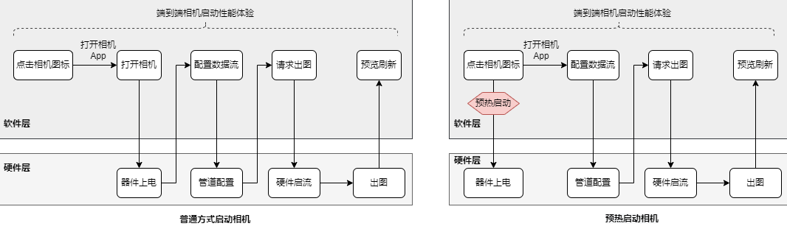
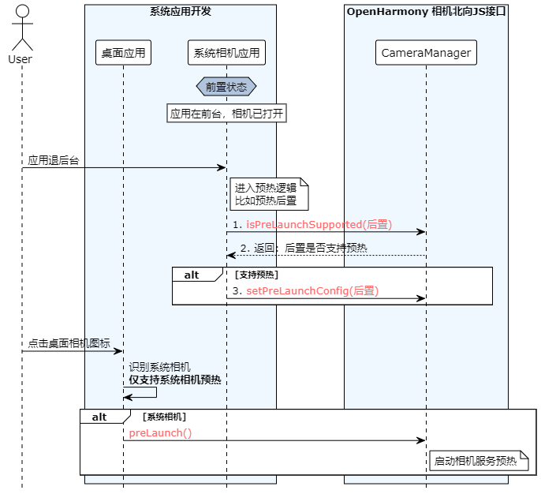
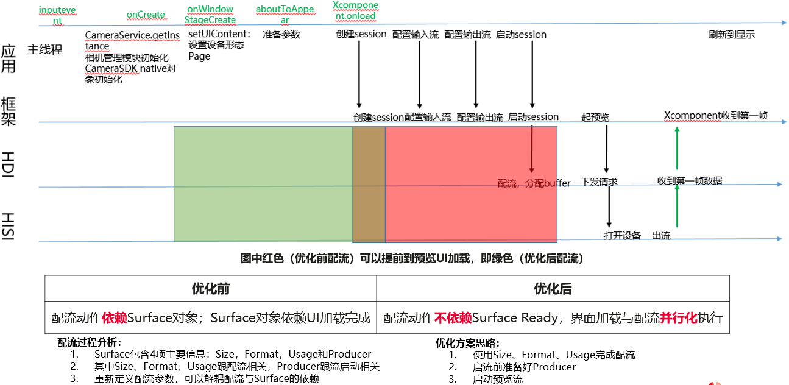
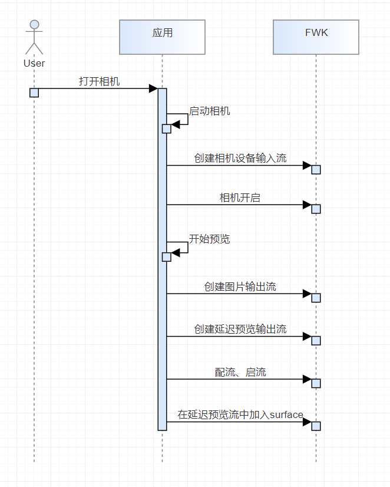
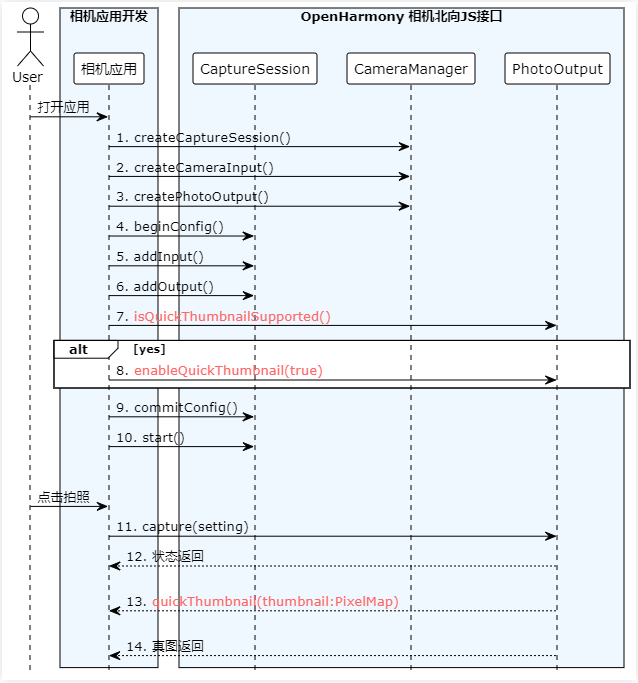

## <center>OpenHarmony**相机性能提升开发指导**</center>

# 概述	

​	相机启动性能受限于底层器件上点、流程Pipeline初始化等耗时操作影响，本文档旨在为开发者提供更进一步功能，提升相机启动速度以及拍照返回缩略图速度。相关能力与底层器件相关，不代表所有硬件均支持相关特性。

​	相关特性分别在打开相机设备过程、配流过程以及拍照过程中。本文档针对三个场景分别进行介绍

# 预热启动

## 场景描述

​	普通情况下相机应用的启动是用户通过点击桌面相机图标触发的。桌面应用感知用户点击相机图标，然后通知应用管理器启动对应的相机应用（进程），这个过程是比较耗时的。进入相机应用后，开始进入相机启动流程。经典的相机启动过程会经过，“相机设备打开”，“配置数据流”，“启动数据流等”，这也是一个耗时的过程。

​	相机启动方案是把“相机设备打开”这个动作提前到相机应用启动之前，即在用户点击相机图标，还没等相机应用启动的时候，触发相机设备打开的动作，从而缩短相机应用内启动相机的流程，加速相机启动。使用预热启动前后的相机应用流程对比如下：




## 接口描述

### isPrelaunchSupported

isPrelaunchSupported(camera: CameraDevice) : boolean

在setPrelaunchConfig接口使用前调用，用于判断指定cameraDevice是否支持预热启动。

**系统能力：** SystemCapability.Multimedia.Camera.Core

**参数：**

| 参数名 | 类型         | 必填 | 说明       |
| ------ | ------------ | ---- | ---------- |
| camera | CameraDevice | 是   | 相机信息。 |

**返回值：**

| 类型    | 说明                                 |
| ------- | ------------------------------------ |
| boolean | 返回指定cameraDevice是否支持预热启动 |

**错误码：**

不涉及

**示例：**

```js
import camera from '@ohos.multimedia.camera'

this.cameraManager = camera.getCameraManager(globalThis.abilityContext);
let cameras = this.cameraManager.getSupportedCameras()
if(this.cameraManager.isPrelaunchSupported(cameras[0])) {
     this.cameraManager.setPrelaunchConfig({cameraDevice: cameras[0]});
}
```

### setPrelaunchConfig

setPrelaunchConfig(camera: CameraDevice) : void

配置相机预热参数，指定相机设备（待扩展流参数信息等）。
用户操作会产生下一次进入相机的预热配置变化，或是退出相机时，向相机服务发送预热配置参数。

**需要权限：** ohos.permission.CAMERA

**系统能力：** SystemCapability.Multimedia.Camera.Core

**参数：**

| 参数名 | 类型         | 必填 | 说明       |
| ------ | ------------ | ---- | ---------- |
| camera | CameraDevice | 是   | 相机信息。 |

**返回值：**

无

**错误码：**

| 类型    | 说明                                 |
| ------- | ------------------------------------ |
| BusinessError  | 7400101 缺少参数或者参数类型错误 <br />7400102 权限校验失败 |

**示例：**

```js
import camera from '@ohos.multimedia.camera'

this.cameraManager = camera.getCameraManager(globalThis.abilityContext);
let cameras = this.cameraManager.getSupportedCameras()
if(this.cameraManager.isPrelaunchSupported(cameras[0])) {
    try {
    	this.cameraManager.setPrelaunchConfig({cameraDevice: cameras[0]});
    } catch (error) {
        HiLog.e(TAG, `catch error: ${JSON.stringify(error)}`)
    }
}
```
```json
"requestPermissions": [
      {
        "name": "ohos.permission.CAMERA"
      }
]
```

### prelaunch
prelaunch() : void

用户点击系统相机图标，拉起相机应用同时调用，下发预热请求，使能相机预热启动。

**需要权限：** ohos.permission.CAMERA

**系统能力：** SystemCapability.Multimedia.Camera.Core

**参数：**

无

**返回值：**

无

**错误码：**

| 类型    | 说明                                 |
| ------- | ------------------------------------ |
| BusinessError  | 7400102 权限校验失败 |

**示例：**

```js
import camera from '@ohos.multimedia.camera'

this.cameraManager = camera.getCameraManager(globalThis.abilityContext);
try {
   this.cameraManager.prelaunch(); 
} catch (error) {
    HiLog.e(TAG, `catch error: ${JSON.stringify(error)}`)
}
```
```json
"requestPermissions": [
      {
        "name": "ohos.permission.CAMERA"
      }
]
```

### PrelaunchConfig
新增参数类型，预热配置参数，当前sensor级别预热，待扩展流预热参数

**示例：**

```js
this.cameraManager = camera.getCameraManager(globalThis.abilityContext);
let cameras = this.cameraManager.getSupportedCameras()
this.prelaunchConfig: PrelaunchConfig = {
    cameraDevice: cameras[0]
}
if(this.cameraManager.isPrelaunchSupported(cameras[0])) {
     this.cameraManager.setPrelaunchConfig(this.prelaunchConfig);
}
```


## 调用流程

启动方案调用流程图建议如下：



## 注意事项

*  预热启动方案相关API均为SystemAPI，如若使用，需申请系统应用权限，app-feature级别设置为hos_system_app。


# 延时配流

## 场景描述

经典的相机启动过程经过“相机设备打开”、“配置数据流”、“启动数据流”等流程，而配流启流之前需要得到图形组件的surfaceId。

延时配流方案是把配流启流与surface解耦，在组件尚未给应用surface之前，可以先进行配流启流，只需要在启流结束之前提供surface，可以提升启动速度，防止影响其他启动优化方案的落地。



## 接口描述

### createDeferredPreviewOutput

createDeferredPreviewOutput(profile: Profile): Promise\<PreviewOutput\>

创建延迟预览输出对象，在配流时替代普通的预览输出对象加入数据流。

**系统能力：** SystemCapability.Multimedia.Camera.Core

**参数：**

| 类型    | 说明                 |
| ------- | -------------------- |
| Profile | 相机预览流的配置文件 |

**返回值：**

| 类型          | 说明               |
| ------------- | ------------------ |
| PreviewOutput | 返回预览输出对象。 |

**错误码：**

不涉及

**示例：**

```js
import camera from '@ohos.multimedia.camera';

function getDeferredPreviewOutput(context: Context, previewProfile: camera.Profile): Promise<PreviewOutput> {
  const cameraManager = camera.getCameraManager(context);
  const output: Promise<PreviewOutput> = 	 cameraManager.createDeferredPreviewOutput(previewProfile);
  return output;
}
```

### addDeferredSurface

addDeferredSurface(surfaceId: string): Promise\<void\>

配置延迟预览的Surface，可以在session.commitConfig()配流和session.start()启流之后运行。

**系统能力：** SystemCapability.Multimedia.Camera.Core

**参数：**

| 类型   | 说明                  |
| ------ | --------------------- |
| string | 预览使用的surfaceId。 |

**返回值：**

无

**错误码：**

| 类型          | 说明                  |
| ------------- | --------------------- |
| BusinessError | 7400104 session未配置 |

**示例**：

```js
import camera from '@ohos.multimedia.camera';

function async preview(context: Context, cameraInfo: camera.Device, previewProfile: camera.Profile, photoProfile: camera.Profile, surfaceId: string): Promise<void> {
  const cameraManager: camera.CameraManager = camera.getCameraManager(context);
  const cameraInput camera.CameraInput = await cameraManager.createCameraInput(cameraInfo)
  const previewOutput: camera.PreviewOutput = await cameraManager.createDeferredPreviewOutput(previewProfile);
  const photoOutput: camera.PhotoOutput = await cameraManager.createPhotoOutput(photoProfile);
  const session: camera.CaptureSession  = await this.mCameraManager.createCaptureSession();
  await session.beginConfig();
  await session.addInput(cameraInput);
  await session.addOutput(previewOutput);
  await session.addOutput(photoOutput);
  await session.commitConfig();
  await session.start();
  await previewOutput.addDeferredSurface(surfaceId);
}
```

## 调用流程



## 注意事项

* 延时配流方案相关API均为SystemAPI，如若使用，需申请系统应用权限，app-feature级别设置为hos_system_app。


# 快速缩略图
## 场景描述

相机拍照性能依赖算法处理的速度，算法链越复杂、效果就越好，但同时处理时间就越长。要能够从拍照流程上进行优化，既满足后处理算法处理的要求，又不要阻塞前台的拍照速度。

通过相机快速缩略图技术，相机拍照可单独输出拇指缩略图，在真图没有上来前，提前上报一张缩略图给应用去显示，提升shot2see用户感知拍照速度。

## 接口描述

### isQuickThumbnailSupported

isQuickThumbnailSupported() : boolean

是否支持快速缩略图。

在CaptureSession.addOutput(photoOutput： PhotoOutput)、CaptureSession.addInput(cameraInput： CameraInput)之后，CaptureSession.commitConfig()之前生效。

**系统能力：** SystemCapability.Multimedia.Camera.Core

**参数：**

无

**返回值：**

| 类型    | 说明                                             |
| ------- | ------------------------------------------------ |
| boolean | 返回当前CaptureSession中拍照流是否支持快速缩略图 |

**错误码：**

| 类型          | 说明                  |
| ------------- | --------------------- |
| BusinessError | 7400104 session未配置 |

**示例：**

```js
import camera from '@ohos.multimedia.camera'

this.cameraManager = camera.getCameraManager(globalThis.abilityContext);
let cameras = this.cameraManager.getSupportedCameras()
// 创建CaptureSession实例
this.captureSession = await this.cameraManager.createCaptureSession()
// 开始配置会话
await this.captureSession.beginConfig()
// 把CameraInput加入到会话
this.mCameraInput = await this.cameraManager.createCameraInput(cameras[0])
await this.cameraInput.open()
await this.captureSession.addInput(this.cameraInput)
// 把PhotoOutPut加入到会话
this.photoOutPut = await this.cameraManager.createPhotoOutput(photoProfile, surfaceId)
await this.captureSession.addOutput(this.photoOutPut)

boolean isSupported = this.photoOutPut.isQuickThumbnailSupported()
```

### enableQuickThumbnail 

enableQuickThumbnail (enabled:bool): void

使能/去使能快速缩略图。

在CaptureSession.addOutput(photoOutput： PhotoOutput)、CaptureSession.addInput(cameraInput： CameraInput)之后，CaptureSession.commitConfig()之前生效。

**系统能力：** SystemCapability.Multimedia.Camera.Core

**参数：**

| 参数名  | 类型    | 必填 | 说明               |
| ------- | ------- | ---- | ------------------ |
| enabled | boolean | 是   | 是否使能快速缩略图 |

**返回值：**

无

**错误码：**

| 类型    | 说明                                 |
| ------- | ------------------------------------ |
| BusinessError  | 7400104 session未配置 |

**示例：**

```js
import camera from '@ohos.multimedia.camera'

this.cameraManager = camera.getCameraManager(globalThis.abilityContext);
let cameras = this.cameraManager.getSupportedCameras()
// 创建CaptureSession实例
this.captureSession = await this.cameraManager.createCaptureSession()
// 开始配置会话
await this.captureSession.beginConfig()
// 把CameraInput加入到会话
this.cameraInput = await this.cameraManager.createCameraInput(cameras[0])
await this.cameraInput.open()
await this.captureSession.addInput(this.cameraInput)
// 把PhotoOutPut加入到会话
this.photoOutPut = await this.cameraManager.createPhotoOutput(photoProfile, surfaceId)
await this.captureSession.addOutput(this.photoOutPut)
boolean isSupported = this.photoOutPut.isQuickThumbnailSupported()
if (isSupported) {
    // 使能快速缩略图
    this.photoOutPut.enableQuickThumbnail(true)
}
```

### on
on (type: "quickThumbnail", callback: AsyncCallback<thumbnail: PixelMap>): void

配置相机缩略图回调接口

在enableQuickThumbnail(true)使能快速缩略图之后监听生效。

**系统能力：** SystemCapability.Multimedia.Camera.Core

**参数：**

| 参数名 | 类型   | 必填 | 说明         |
| ------ | ------ | ---- | ------------ |
| type   | String | 是   | 监听事件类型 |
| callback    | Function | 是   | 回调函数，返回PixelMap |

**返回值：**

无

**错误码：**

不涉及

**示例：**

```js
import camera from '@ohos.multimedia.camera'

this.cameraManager = camera.getCameraManager(globalThis.abilityContext);
let cameras = this.cameraManager.getSupportedCameras()
// 创建CaptureSession实例
this.captureSession = await this.cameraManager.createCaptureSession()
// 开始配置会话
await this.captureSession.beginConfig()
// 把CameraInput加入到会话
this.cameraInput = await this.cameraManager.createCameraInput(cameras[0])
await this.cameraInput.open()
await this.captureSession.addInput(this.cameraInput)
// 把PhotoOutPut加入到会话
this.photoOutPut = await this.cameraManager.createPhotoOutput(photoProfile, surfaceId)
await this.captureSession.addOutput(this.photoOutPut)
boolean isSupported = this.photoOutPut.isQuickThumbnailSupported()
if (isSupported) {
    // 使能快速缩略图
    this.photoOutPut.enableQuickThumbnail(true)
}
this.photoOutPut.on('quickThumbnail', (err, pixelmap) => {
    if (err || pixelmap === undefined) {
        Logger.error(this.tag, 'photoOutPut on thumbnail failed ')
        return
    }
    // 显示或保存pixelmap
    this.showOrSavePicture(pixelmap)
})
```


## 调用流程

启动方案调用流程图建议如下：



## 注意事项

*  快缩缩略图方案相关API均为SystemAPI，如若使用，需申请系统应用权限，app-feature级别设置为hos_system_app。
*  isQuickThumbnailSupported及enableQuickThumbnail 接口需要在CaptureSession.addOutput(photoOutput： PhotoOutput)、CaptureSession.addInput(cameraInput： CameraInput)之后，CaptureSession.commitConfig()之前生效。
*  on (type: "quickThumbnail", callback: AsyncCallback<thumbnail: PixelMap>)接口需要在enableQuickThumbnail (true)之后生效。